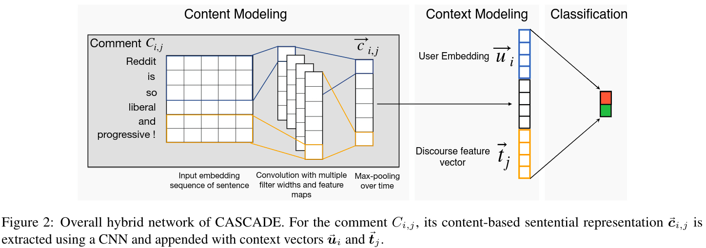

# CMU CS 11-747 (Neural Networks for NLP), Spring 2021, Assignment 3

[CASCADE: Contextual Sarcasm Detection in Online Discussion Forums](http://aclweb.org/anthology/C18-1156) (COLING 2018, New Mexico).

## Description

The original model is called ContextuAl SarCasm DEtector (CASCADE), which adopts a hybrid approach of both content and context-driven modeling for sarcasm detection in online social media discussions (Reddit).
We implemented a content-based variant of the original CASCADE model for the purpose of this assignment.

## Requirements

1. Clone this repo.
2. Python (2.7 or 3.3-3.6)  
3. Install your preferred version of TensorFlow 1.4.0 (for CPU, GPU; from PyPI, compiled, etc).
4. Install the rest of the requirements: `pip install -r requirements.txt`
5. Download the [FastText pre-trained embeddings](https://dl.fbaipublicfiles.com/fasttext/vectors-english/crawl-300d-2M.vec.zip) and extract it somewhere.


## Running CASCADE

<p align="center">
  
</p>

Hybrid CNN combining user-embeddings and discourse-features with textual modeling.
 
```bash
cd src
python process_data_isarc.py [path/to/FastText_embedding]
python train_cascade_isarc.py
```

The CNN codebase has been adapted from the [repo cnn-text-classification-tf from Denny Britz](https://github.com/dennybritz/cnn-text-classification-tf).


## References

[1]. Khodak, Mikhail, Nikunj Saunshi, and Kiran Vodrahalli. ["A large self-annotated corpus for sarcasm."](https://arxiv.org/abs/1704.05579) Proceedings of the Eleventh International Conference on Language Resources and Evaluation. 2018.

[2]. Celli, Fabio, et al. ["Workshop on computational personality recognition (shared task)."](http://www.aaai.org/ocs/index.php/ICWSM/ICWSM13/paper/download/6190/6306) Proceedings of the Workshop on Computational Personality Recognition. 2013.
